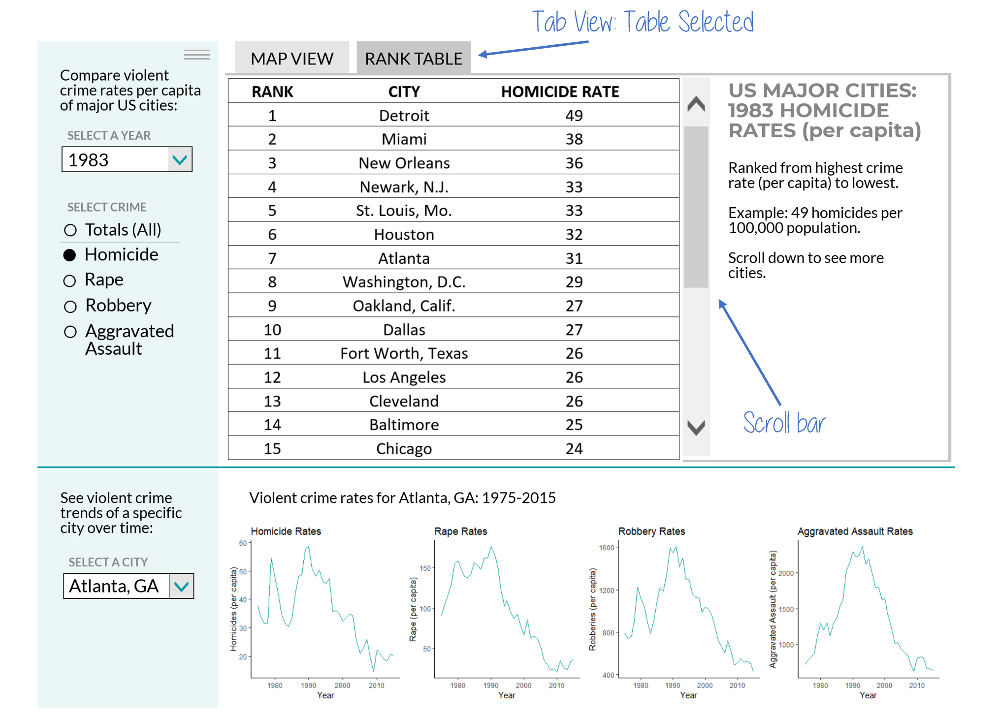

# US Violent Crimes Shiny App Proposal

Contributors: Alycia Butterworth ([alyciakb](https://github.com/alyciakb)), George J. J. Wu ([GeorgeJJW](https://github.com/GeorgeJJW))

## Overview

US government agencies typically do not publish crime data in a format that is readily accessible to the general public. To address this issue, we propose developing a free and open-source tool that can empower the public to visually explore crime rates and crime trends of major US cities. Our project aims to display the geographical distribution of four types of violent crimes: homicide, rape, robbery, and aggravated assault. We will also encourage users to explore the crime trends, by allowing them to select a particular city and examine how crime rates for that city have changed over time.

## Data

This project will visualize the crime data of more than 50 US cities between the year 1975 and 2015, using information compiled by [The Marshall Project](https://github.com/themarshallproject/city-crime). Each city and year is associated with 9 variables, as follows:

| Variable | Description |
| -- | -- |
| department_name | Name of the city in which a violent crime was reported |
| year | Year in which a violent crime was reported |
| homs_per_100k | Homicide crime rate per 100k population |
| rape_per_100k | Rape crime rate per 100k population |
| rob_per_100k | Robbery crime rate per 100k population |
| agg_ass_per_100k | Aggravated assault crime rate per 100k population |
| violent_per_100k | Rate of all four types of violent crimes per 100k population |
| lon | The longitude of a city |
| lat | The latitude of a city |

Note that we will derive the longitude and latitude of a city using its name, as this information is not present in the original data source.

## Usage scenario

Richard is an electrician born and raised in Denver, Colorado. Just recently, he received a lucrative job offer from Kansas City, Missouri. Richard does not mind moving two states over, but he understands that his new job will require him to frequently perform late night repairs in urban neighborhoods. Before making a decision, Richard wants to get a sense of how much criminal activities are in both cities.

Richard does not know programming, and he cannot make sense of the crime data available on the US government websites. This is when he comes across this "US Violent Crime Visualizer" app. When Richard opens the app, he will see how violent crimes are geographically distributed across the United States. Using options on the left side of the screen, Richard can select data from the year 2015, and he can also filter for a particular type of crime. In this case, Richard wants to examine all four types of violent crimes. By clicking on the `Rank Table` tab at the top of the screen, Richard will be able to compare crime rates between cities on a ranked table. Richard should be able to see that for the year of 2015, Kansas City had a higher violent crime rate per 100k population than Denver.

In the bottom left corner of the screen, Richard will be able to select Denver from a dropdown menu. Using the four line graphs in the bottom half of the screen, he will be able to explore how the different crime rates for Denver had changed over time. He can also do the same for Kansas City. Richard will notice that Kansas City's violent crime rates have dropped considerably over the course of ten years, whereas Denver's crime rates have been holding steady. With this information about the two cities, Richard can make a more informed decision about his relocation.     

## App Description and Sketch

The "US Violent Crime Visualizer" app will two tab view options: map view and rank table view, and have a collapsible left bar that gives users the options to filter for the information they want to visualize. The map view will plot the variable rate per capita of each city, with both the size and darkness of the dot corresponding to the crime rate. A larger, darker dot represents a higher rate. The rank table view will list the cities in order from highest crime rate per capita to lowest. The data displayed will be the city name and the crime rate per capita (rounded to the nearest integer). In the left bar, the user has the option to select from a dropdown menu a specific year between 1975 and 2015, or the average across all years. A radio button allows the user to select the crime type they wish to view: homicide, rape, robbery, aggravated assault, or total/all.

Below the map (or table) are four small line graphs that allow a user to learn more about a specific city. The line charts show the per capita crime rate across the years (1975-2015). There is one plot for each crime type: homicide, rape, robbery, and aggravated assault. The left bar has a dropdown menu that gives the option for the user to select a specific city or the average across all cities.

### Sketch: Map View

### Sketch: Table View

